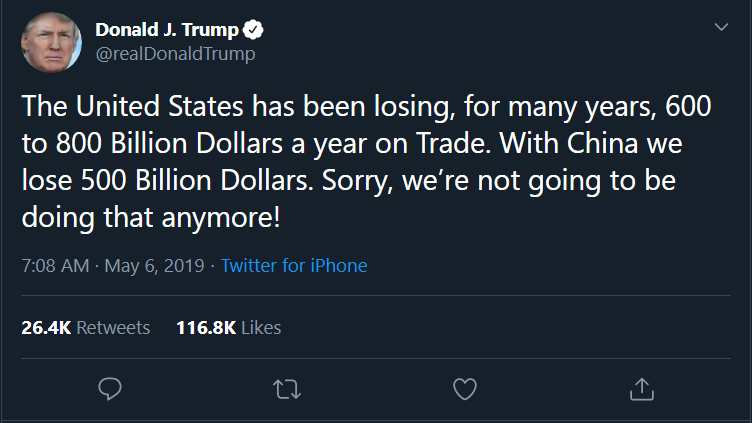

# Team 5 — KAAS

### Team Members

Ash Ranu 
Aresh Bakau Wint 
Sandra Nova 
Keron Edwards 

### Motivation 
1. Core message: Trump’s impact on the financial markets and political environment in America

2. Donald Trump has redefined the American Presidency in many ways including his use of social media. Extracting and interrogating his archive of Tweets we sought to investigate the effect he has had communicating via this medium on both the financial markets and on political discourse in general.

    
### Questions
#### Impact of @realDonaldTrump language on::
1) Trade war with China. This has been the main causal factor of recent market volatility. Using time series data we sought to understand the connection between key Trump Tweets and market movements.

We found that several key Tweets had the effect of moving the S&P 500. Two noteworthy examples are as follows.

2. Analysis of lauguage used by Trump in his Tweets with a detailed analysis of Trump tweets including top words, sentiment distribution and vartion in sentiment accross subsets of Tweets filetered for key terms. Results are as follows:

3. Scattertext polt to look at the differences in langauge between Trump and Obama. This will allow us to better understand the varaitions in words used and the context in which they are used.

### Data Sources
* Tweets - Twitter API and Tweepy Python Library. We set up a Twitter developer account and pip installed Tweepy. Twitter has 3 tiers of developer account each with different levels of access. The free tier only allows for a maximum of 3200 tweets to be downloaded. Following an initial exploration of Tweepy and the Twitter API and hitting a roadblock we explored other options. There is a site which has the complete catalogue of Trump tweets which allows you to filter by date range and download to CSV. http://www.trumptwitterarchive.com/archive
* We also utilised another python library called Twitterscraper. This allows you to scrape Tweets using a Python to retrieve content and Beautifullsoup to parse the retrieved content into a JSON object or CSV. * We used this to pull tweets for the keyword WeWork as well as from Elon Musk’s Twitter profile. 
* We also used market data from IEX finance and WeWork bond price data from CapIQ.	

### Data Cleanup
We have put the rough working into 4 notebooks, 1 for each of the analysis types we did including the wordcloud
1. [Wordcloud](wordcloudv1.2.ipynb)
2. [Trump Tweet Analysis](Trump_Analysis_v1.0.ipynb)
3. [Tweet and Price Movement Analysis](test_code_v2.5.ipynb)
4. [Scatter Text](scatter_textv1.ipynb) - Note this can take up to 5 miuntes to open

### [There is also a notebook for the presenation using the RISE library in Jupyter Notebook.](PRES_V1.0.ipynb)

## Implications 

Trump has forever changed political discourse. His language is unique introducing a new phrases into the lexicon.  His exorating style beings a level of vitriol not previously witnesses as can be seen in the sentiment analysis. His utilisation of social media to make presidential announcements/proclamation reverberates

