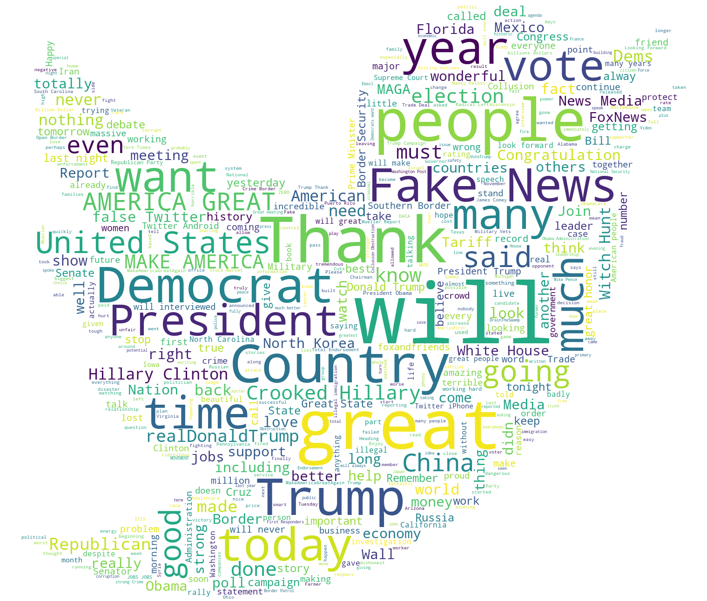
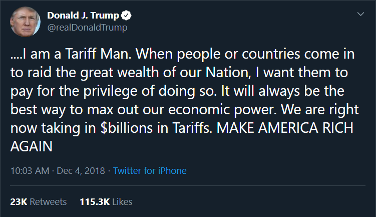
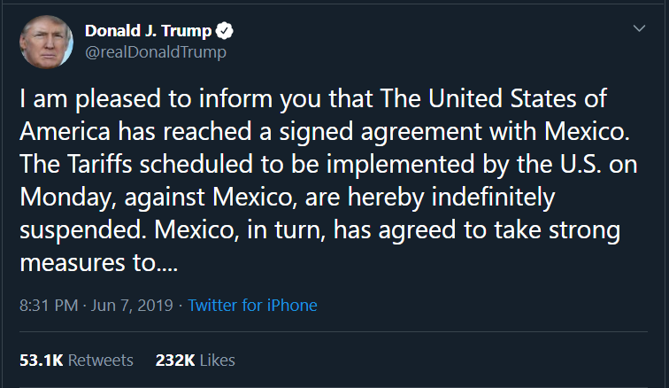

# Team 5 — KAAS

### Team Members

* Ash 
* Aresh 
* Sandra 
* Keron 

### Motivation 
1. Core message: Trump’s impact on the financial markets and political environment in America

2. Donald Trump has redefined the American Presidency in many ways including his use of social media. Extracting and analyzing his archive of Tweets we sought to investigate the effect he has had communicating via this medium on both the financial markets and on political discourse in general.

    
### Questions
#### Impact of @realDonaldTrump language on:
1) Trade war with China. This has been the main causal factor of recent market volatility. Using time series data we sought to understand the connection between key Trump Tweets and market movements.

We found that several key Tweets had the effect of moving the S&P 500. Two noteworthy examples are as follows. 
 
This Tweet contributed to a percentage Change in SPY on 2018/12/04 of -3.24% . 
 
 
 
This Tweet contributed to a percentage Change in SPY on 2018/12/04 of +1.0007% . 
 
 
 
2. Detailed analysis of Trump Tweets including top words (including Bigrams and Trigrams), sentiment distribution and vartion in sentiment accross subsets of Tweets filetered for key terms. Results are as follows: 

3. Scattertext 
* Scattertext is a tool for locating distinguishing terms in different documents and presenting them in an interactive scatter plot. The Scattertext plot allows us to explore the differences in language used by Trump and Obama on Twitter. 
* For this analysis we used Trump Tweets from the start of 2016 to present and Obama's Tweets from 2012 to 2017. Obama's Tweets were obtained from https://community.periscopedata.com/t/x1fy7p/barack-obamas-tweet-history. Whilst from slightly different time periods, both sets of Tweets cover the their respective presidential tenure and as such serve as a good point of comparison. 
* Each point on the scatterplot is a word mentioned by Trump or Obama on their respective Twitter accounts. The closer a point is to the top left corner of the plot, the more frequently that word was used by Obama. The further to the right a point is the more that word was used by Trump. Words frequently used by both presidents, are placed in the upper-right-hand corner. 
* Words that are used infrequently by both are placed in the bottom-left-hand corner. 
* Terms are colored by their association. Those that are more associated with Obama are blue, and those more associated with Trump are red.

* For example one of Obama's most frequently used words which was seldom used by Trump was "climate". Clicking on this term in the plot brings up a side by side comparison of the tweets where the word "climate" was used. As per the screenshot below Obama mentioned "climate" 321 times to Trump's six. One of those six mentions by Trump was to announce that America was pulling out of the Paris Climate Agreement, a document to which >190 countries are signatories.

### Data Sources
* Tweets - Twitter API and Tweepy Python Library. We set up a Twitter developer account and pip installed Tweepy. Twitter has 3 tiers of developer account each with different levels of access. The free tier only allows for a maximum of 3200 tweets to be downloaded. Following an initial exploration of Tweepy and the Twitter API and hitting a roadblock we explored other options. We found a site which has the complete catalogue of Trump tweets which allows you to filter by date range and download to CSV. http://www.trumptwitterarchive.com/archive
* For Obama's Tweets we also relied on an archive downloaded from https://community.periscopedata.com/t/x1fy7p/barack-obamas-tweet-history 
* In addition we utilized another python library called Twitterscraper which we ran via the command line. Twitterscraper allows you to scrape Tweets using a Python to retrieve content and Beautifullsoup to parse the retrieved content into a JSON object or CSV. We used this to pull tweets for the keyword WeWork as well as from Elon Musk’s Twitter profile. 
* To extract market data we used IEX Finance and for the WeWork Bond Price data we utilized CapIQ.

### Data Cleanup
We have put the rough working into 4 notebooks, 1 for each of the analysis types we did including the WordCloud: 
1. [Wordcloud](wordcloudv1.2.ipynb)
2. [Trump Tweet Analysis](Trump_Analysis_v1.0.ipynb)
3. [Tweet and Price Movement Analysis](test_code_v2.5.ipynb)
4. [Scatter Text](scatter_textv1.ipynb) - Note this can take up to 5 miuntes to open

### [There is also a notebook (PRES_V1.0.ipynb) with cleaned up code which we used to do the slide presenatation using the RISE Python library for Jupyter Notebook.](PRES_V1.0.ipynb)

## Implications 

Trump has forever changed political discourse. His language is unique, introducing a new phrases into the lexicon.  Futhermore his exorating style beings a level of vitriol not previously witnessesed. Trump's use of social media is unprescentated for any world leader, let alone for the POTUS and had a signficaint impact on financial markets as well as the political landscape accorss the world. 

